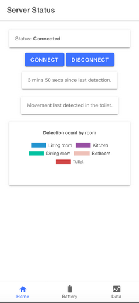
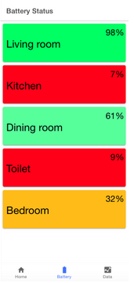
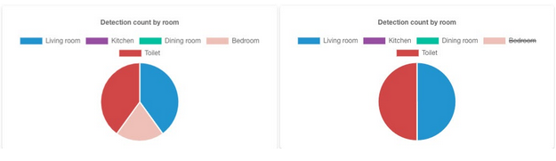

# SWEN325 A3

For the third assignment for SWEN325, we were to implement an app using MQTT to communicate with an MQTT broker set up on campus that communicated pseudo-random strings at 5 second intervals. The setup for the assignment was that this was an MQTT service using motion detectors set up in an elderly person's house for their safety. The pseudo-random strings contained data for every room in the house, including the name of the room, the battery level of the motion detector, the time and date the data was recorded, and whether or not motion was detected. I used the Paho MQTT and Charts.js libraries to facillitate this project.

